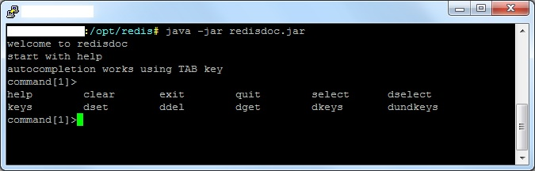

<h1>redisdoc = Redis documentation console</h1>

Why this project exists? Because there is currently no such tool and I needed to document my Redis database.
So I created a console that mimics Redis console functionality (because I suppose if you need to document 
Redis database, you already use Redis and you shouldn't be forced to learn something radically new), but 
redisdoc contains commands specific for documenting your Redis database.

<h2>How to download & run:</h2> 
Download contents of <code>bin</code> directory:

<ul>
	<li><code>redisdoc.jar</code>: Java executable file</li>
	<li><code>redisdoc.properties</code>: configuration</li>
</ul>

Run this application in terminal / cmd: <code>java -jar redisdoc.jar</code>

<h3>Why Java application?</h3>
Because I'm a Java programmer :) And also because I use several different 
operating systems and this application must run on all of them.

<h2>Functionality:</h2>

<h3>Available commands:</h3>
<code>help</code> show help for all commands

<code>help &lt;command&gt;</code> show help for specific command

<code>quit</code> or <code>exit</code> quit application

<code>dinfoset</code> set database information - author, database name and description

<code>dinfoget</code> get database information - author, database name and description

<code>select &lt;number&gt;</code> select redis database with your keys

<code>dselect &lt;number&gt;</code> select redis database for documentation

<code>keys &lt;pattern&gt;</code> select keys using pattern

<code>dset &lt;doc-name (pattern)&gt; &lt;description&gt;</code> set documentation key (pattern) with description

<code>ddel &lt;doc-name&gt;</code> deletes documentation key

<code>dkeys &lt;pattern&gt;</code> list documentation keys using pattern
  

<code>dget &lt;doc-name&gt;</code>
documentation key detail. Contains several optional parameters, which can be combined

<code>dget --type &lt;doc-name&gt;</code>
show keys with their types

<code>dget --detail &lt;doc-name&gt;</code>
show keys with their values or length

<code>dget --ttl &lt;doc-name&gt;</code>
show keys with ttl
  

<code>dundkeys</code>
retrieves undocumented keys from your database. Contains several optional parameters, which can be combined

<code>dundkeys --type</code>
show undocumented keys with their types

<code>dundkeys --detail</code>
show undocumented keys with their values or length

<code>dundkeys --ttl</code>
show undocumented keys with ttl

<h2>Usage</h2>

I have following Redis database, where are Java news stories. Each news story has some tags (for example news story "Java 8" has tags java, breaking news, java 8):

<pre>
<code>
news:hello-world-java
news:java-8
news:java-summer-fun
tag:java
tag:java-8
tag:breaking-news
news-tags:java-8
</code>
</pre>

<h3>Description</h3>

<ul>
<li>Keys starting with "news" contain news story detail</li>
<li>Keys starting with "tag" contain tag detail (full name)</li>
<li>Keys starting with "news-tags" contain tags set for particular news story</li>
</ul>

<h3>Documenting database</h3>

<pre>
<code>
// list all commands
press &lt;TAB&gt;, for detailed information run command "help"
// set info about database
dinfoset tags "Jiri Pinkas" "news tags database"
// see info about database
dinfoget
// show all undocumented keys
dundkeys
// document keys
dset news:* "news story detail"
dset tag:* "tag detail (full name)"
dset news-tags:* "tags set for particular news story"
// see current documentation detail
dkeys *
// DONE! EASY, RIGHT?
</code>
</pre>

<h2>My other projects:</h2>
<ul>
	<li><a href="http://www.javavids.com" target="_blank" title="Java video tutorials">Java video tutorials</a> (free online tutorials)</li>
	<li><a href="http://sitemonitoring.sourceforge.net/" target="_blank" title="Website monitoring software">Website monitoring software</a> (free OSS software)</li>
	<li><a href="http://www.java-skoleni.cz" target="_blank" title="Java školení">Java školení</a> (in Czech)</li>
	<li><a href="http://www.sql-skoleni.cz" target="_blank" title="Java školení">SQL školení</a> (in Czech)</li>
</ul>

